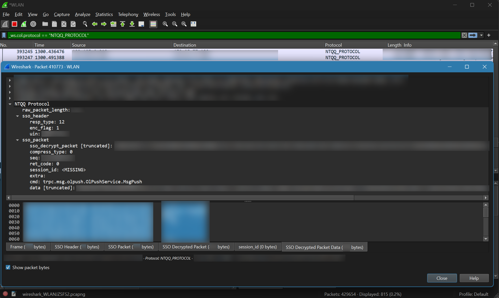

## wireshark_ntqq_protocol_plugin

> [!NOTE]
>
> **This project is provided for learning and communication purposes only, please delete it within 24 hours**
>
> **This project is intended solely for learning about computer networking and writing related knowledge with Wireshark**
>
> **The project is in a very early WIP stage and is not recommended for use**

### Support

- [X] incoming & outgoing uni TCP packet
- [X] incoming & outgoing Highway (TCP, HTTP) packet

### Usage

1. Manually compile git submodule [simple-crypto](https://github.com/pk5ls20/simple-crypto)
2. Manually compile [brimworks/lua-zlib](https://github.com/brimworks/lua-zlib) (and perhaps [zlib](https://github.com/madler/zlib) as well)
3. Place the compiled tea and zlib related library files into the directories specified by Lua's package.cpath
4. Place the lua scripts in the Wireshark personal lua scripts directory
5. Go to `Preferences -> Protocols -> NTQQ_PROTOCOL` to enter the required key in Wireshark
6. ~~Wireshark, launch!~~

### Test environments

- Wireshark Version 4.2.6 (v4.2.6-0-g2acd1a854bab)
- Wireshark Lua 5.2.4 (with UfW patches)
- MinGW-W64 gcc 12.3.0

### Special Thanks

- [synodriver/simple-crypto: A simple c lib to calc md5, tea, and lua binding (github.com)](https://github.com/synodriver/simple-crypto)
- [LagrangeDev/lagrange-python: An Python Implementation of NTQQ PC Protocol (github.com)](https://github.com/LagrangeDev/lagrange-python)
- [LagrangeDev/LagrangeGo: An Go Implementation of NTQQ PC Protocol (github.com)](https://github.com/LagrangeDev/LagrangeGo)
