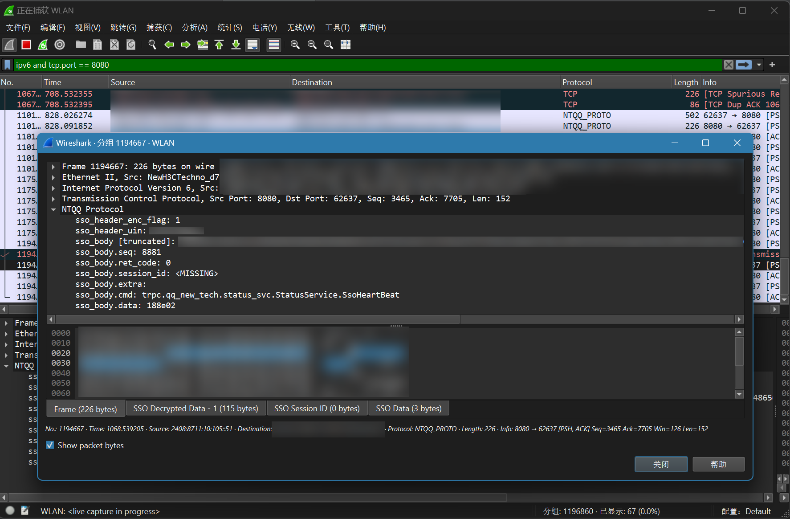

## wireshark_ntqq_protocol_plugin

> [!NOTE]
>
> **The project is in a very early WIP stage and is not recommended for use**

### Support

- [X] Parse client incoming packets (business TEA decryption, ~~login TEA decryption, login ECDH~~)
- [x] Parse client outgoing packets

### Usage

1. Compile `simple-crypto` manually
2. Put the compiled `tea.dll/tea.so` into the `package.cpath` of the lua
3. Place the lua scripts in the Wireshark personal lua scripts directory
4. Go to `Preferences -> Protocols -> NTQQ_PROTOCOL` to enter the required key in Wireshark
5. ~~Wireshark, launch!~~

### Test environments

- Wireshark Version 4.2.6 (v4.2.6-0-g2acd1a854bab)
- Wireshark Lua 5.2.4 (with UfW patches)
- MinGW-W64 gcc 12.3.0

### Special Thanks

- [synodriver/simple-crypto: A simple c lib to calc md5, tea, and lua binding (github.com)](https://github.com/synodriver/simple-crypto)
- [LagrangeDev/lagrange-python: An Python Implementation of NTQQ PC Protocol (github.com)](https://github.com/LagrangeDev/lagrange-python)
